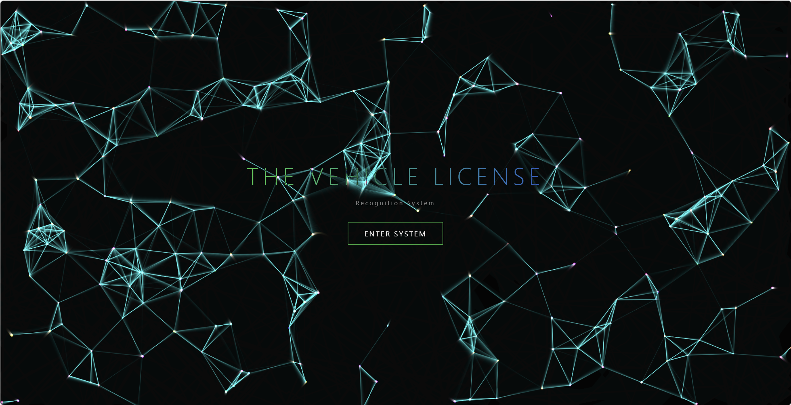
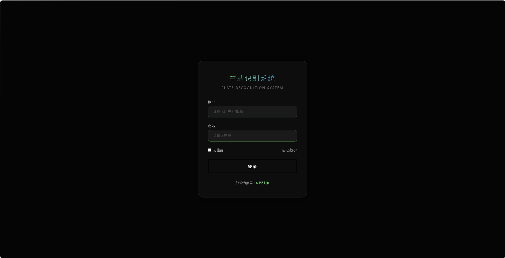
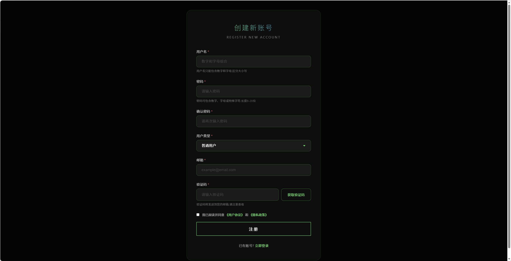
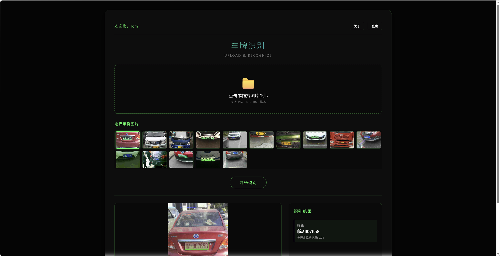
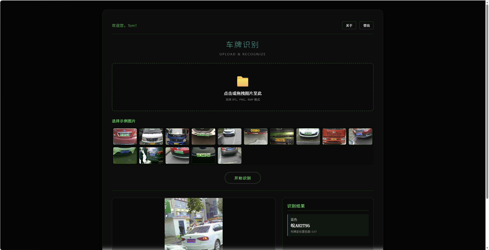
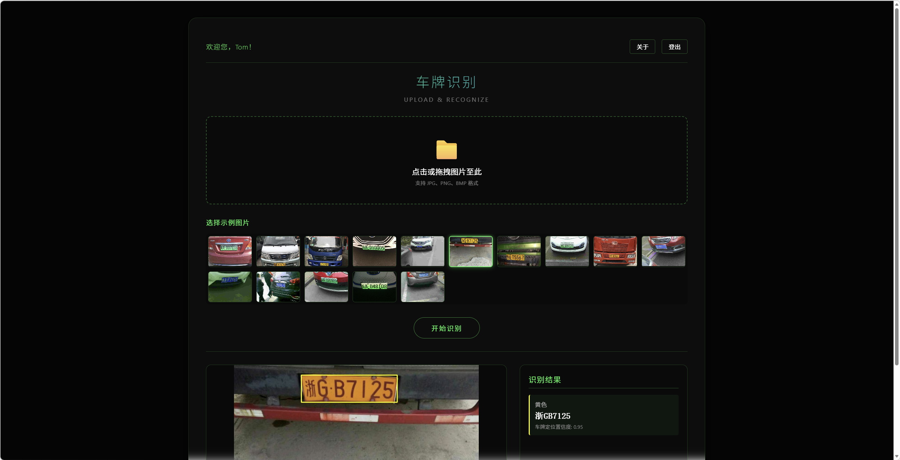
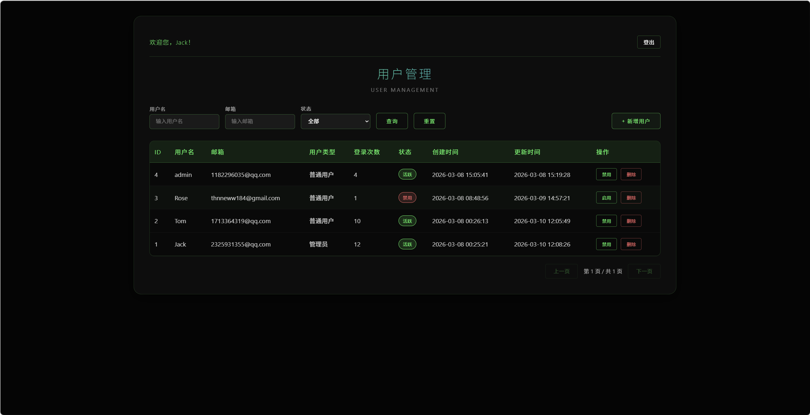

# 车牌识别系统
项目预览网址：www.zpning.top

#### 项目预览图
首页：

登录页：

注册页：

主面板：

管理页：

## 1.1 技术框架介绍
### 1.1.1 Flask框架
Flask是一个轻量级、灵活的Python Web框架，被称为微架构（Microframework）——
它核心只保留Web开发的基础功能（路由、请求处理、响应输出等），但可以通过拓展实现
数据库操作、表单验证、身份认证等复杂功能，非常适合快速开发小型应用、API或原型。
    

**核心特点**：
* 轻量级 & 灵活
* 基于Werkzeug & Jinja2：
  * Werkzeug：处理HTTP请求/响应、路由匹配、会话管理等底层Web逻辑。
  * Jinja2：Flask内置的模板引擎，支持变量渲染、循环、条件判断、
  模板继承等，让前端页面开发更高效。
* 开发友好：内置开发服务器、调试模式，修改代码后自动重启，方便开发调试。
* RESTful支持：轻松处理JSON数据的请求和响应。
* 拓展性强：官方/第三方拓展覆盖几乎所有Web开发场景。

### 1.1.2 YOLOv5模型架构
YOLOv5是由 Ultralytics 团队在 2020 年推出的一款实时目标检测模型，
基于YOLO（You Only Look Once）系列的核心思想（单阶段检测、端到端推理），
在 YOLOv3/YOLOv4 的基础上做了大量工程优化和改进，兼具高性能、高速度、
易部署的特点，是目前工业界和学术界应用最广泛的目标检测模型之一。

**核心定位与特点**：
* 单阶段检测
* 全流程易用性
* 多尺度适配
* 跨平台部署
* 数据增强

### 1.1.3 LPRNet模型架构
LPRNet（License Plate Recognition Network） 是 2018 年由 
Intel 团队提出的轻量级、端到端车牌识别模型。它最大的创新是完全抛弃 
RNN/LSTM，仅用 CNN 结合 CTC Loss 实现序列识别，在速度、精度与
部署友好性上取得了极佳平衡，是目前工业界车牌识别的主流方案之一。

**核心定位与设计思想**
* 端到端，无需字符分割
* 全卷积结构（CNN-only）
* 轻量高效
* 适配复杂场景

### 1.1.4 车牌识别（大致流程）
YOLOv5模型：定位车牌，并将定位到的车牌剪切下来送到LPRNet模型
LPRNet模型：将YOLOv5剪切下来的车牌作为输入，输出车牌号

## 1.2 项目目录结构说明
    Flask_Plate_Recognition/
    ├── data/
    │   ├── ccpd_datasets.yaml       #YOLOv5模型的类别
    │   ├── hyp.yaml                 #YOLOv5的超参数
    │   └── NotoSansCJK-Regular.ttc  #字体文件（仅在YOLOv5_LPRNet_test.py中用到）
    ├── LPRNet/
    │   ├── models/                  #LPRNet模型
    │   └── utils/                   #LPRNet工具
    ├── static/
    │   ├── css/                     #存放css文件
    │   ├── fonts/                   #存放字体文件
    │   ├── images_demo/             
    │   │   ├── images               #示例图片
    │   │   └── images_results       #示例图片对应的结果图片
    │   ├── js/                      #存放js文件
    │   └── favicon.ico              #网页图标 
    ├── templates/                   #存放html文件
    ├── weights/                     #存放模型的权重文件
    │   ├── LPRNet_weight/
    │   └── YOLOv5_weight/
    ├── YOLOv5/                      
    │   ├── models/                  #YOLOv5模型
    │   ├── utils/                   #YOLOv5工具类
    │   └── export.py                #模型导出脚本
    ├── app.py                       #启动文件
    ├── config.py                    #配置文件
    ├── mysql.sql                    #mysql语句
    ├── plate_recognition.py         #车牌识别类
    ├── README.md                    #readme文档
    ├── requirements.txt             #依赖清单文件
    └── YOLOv5_LPRNet_test.py        #模型测试代码

## 1.3 复现此项目的具体流程
### 1.3.1 本地Windows调试
（1）环境配置说明：

以anaconda为例：

先创建conda环境，python版本为3.9.24（不一定非要这个版本）
      
    conda create -n yolov5 python=3.9.24

再按照依赖
    
    pip install -r requirements.txt -i https://pypi.tuna.tsinghua.edu.cn/simple/

即可完成环境配置

（2）运行程序说明：

先运行mysql.sql中的sql代码

再修改config.py中的数据库连接等配置信息

最后运行app.py

### 1.3.2 部署到服务器

（1）租服务器、买域名

这里以阿里云为例：

阿里云服务器对于新人的话第一年是几十RMB，所以还是很划算的。

可以参考我的轻量级服务器配置信息：CPU2核、内存2G、系统盘40GB

镜像信息：选择应用镜像中的宝塔Linux面板9.2.0

域名的话，买完需要进行域名备案（这里不再详细赘述）

（2）部署网站到服务器

（略）

## 贡献者

    

